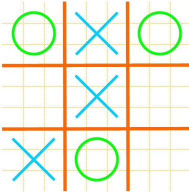

# monte-carlo-tree-search

Simple Game about Tic Tac Toe with Monte Carlo Tree Search.

Just like below:



## Run

run the code:

```
git clone https://github.com/cryer/monte-carlo-tree-search.git
cd monte-carlo-tree-search
python run.py
```

## Note

As we all know,in Tic Tac Toe game,the starting player never lose,at least tie,asuming both are master.
But someone may not know that the first best move of the starting player is not the middle,but the corner.
MCTS also confirms this,but that's just for probability，for masters they always tie.

* ```I made this small game only for showing how Monte Carlo Tree Search works,you may focus on mcts and apply it to your only apps```

## Results

I just show you the process,do not mind my move.
```
    0   |   _       _       _    
    1   |   _       X       _    
    2   |   _       _       _    
______________________________
Your move: 0,0

    0   |   O       _       _    
    1   |   _       X       _    
    2   |   _       _       _    
______________________________

    0   |   O       _       _    
    1   |   X       X       _    
    2   |   _       _       _    
______________________________
Your move: 1,2

    0   |   O       _       _    
    1   |   X       X       O    
    2   |   _       _       _    
______________________________

    0   |   O       X       _    
    1   |   X       X       O    
    2   |   _       _       _    
______________________________
Your move: 2,0

    0   |   O       X       _    
    1   |   X       X       O    
    2   |   O       _       _    
______________________________

    0   |   O       X       _    
    1   |   X       X       O    
    2   |   O       X       _    
______________________________
You lose!

```
MCTS is the starting player,it's also very easy for you to change code to set human as the starting player.Just modify run.py.

## Inspiration

* [int8](https://github.com/int8/monte-carlo-tree-search)

